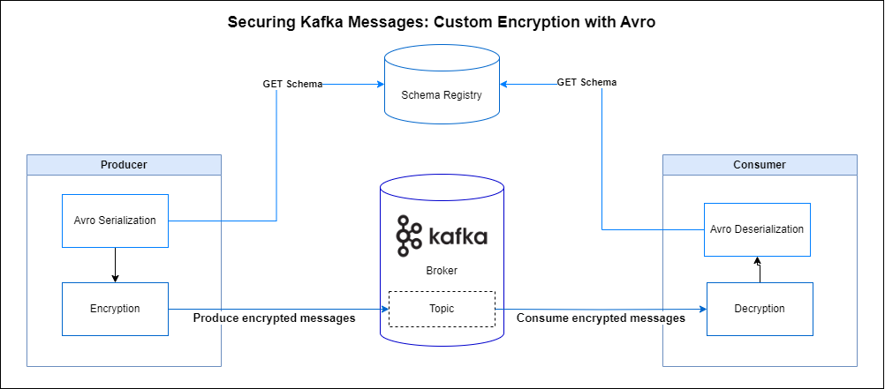
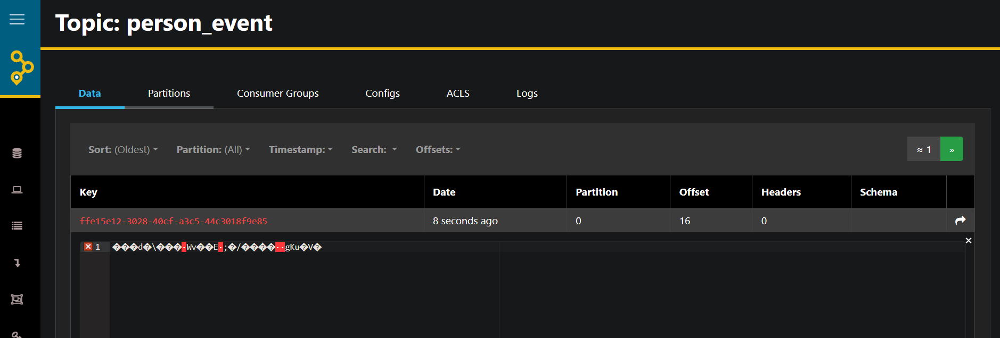
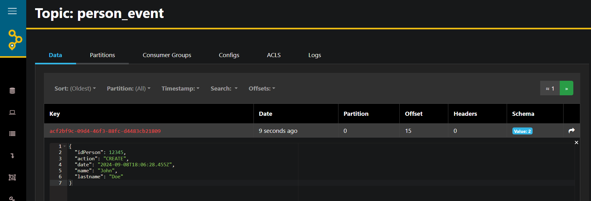

# Kafka Custom Encryption Demo

This project demonstrates custom encryption for Kafka messages using Spring Boot and Avro serialization.


For a detailed walkthrough on how to create and set up this project, including step-by-step instructions, check out my [Medium article](https://medium.com/@ayari.mehdi.93/securing-kafka-messages-custom-encryption-with-avro-and-spring-boot-ad4d1868f404).
## Prerequisites

- Java 17
- Maven
- Docker and Docker Compose

## Getting Started

1. Clone the repository:
   ```
   git clone https://github.com/yourusername/kafka-custom-encryption-demo.git
   cd kafka-custom-encryption-demo
   ```

2. Start the Kafka ecosystem using Docker Compose:
   ```
   docker-compose up -d
   ```
3. Verify that all containers are up and running:
   ```
   docker ps
   ```
   You should see output similar to this:
   ```
    CONTAINER ID   IMAGE                                   COMMAND                  CREATED          STATUS          PORTS                                        NAMES
    f6747239ad94   tchiotludo/akhq:0.20.0                  "docker-entrypoint.s…"   26 seconds ago   Up 7 seconds    0.0.0.0:8880->8080/tcp                       kafka-custom-encryption-demo-akhq-1
    5915fe4bf4f5   confluentinc/cp-schema-registry:7.3.0   "/etc/confluent/dock…"   26 seconds ago   Up 9 seconds    0.0.0.0:8081->8081/tcp                       kafka-custom-encryption-demo-schema-registry-1
    0f6694e1bc5e   confluentinc/cp-kafka:5.5.0             "/etc/confluent/dock…"   27 seconds ago   Up 12 seconds   0.0.0.0:9092->9092/tcp                       kafka-custom-encryption-demo-kafka-1
    974cdf5b876f   confluentinc/cp-zookeeper:7.3.0         "/etc/confluent/dock…"   31 seconds ago   Up 17 seconds   2888/tcp, 0.0.0.0:2181->2181/tcp, 3888/tcp   kafka-custom-encryption-demo-zookeeper-1
   ```
4. Build the project:
   ```
   mvn clean install
   ```

5. Run the application:
   ```
   mvn spring-boot:run
   ```

## Usage

To send a message, use the following curl command:

For Linux/Mac:
```bash
curl -X POST http://localhost:8080/produce \
     -H "Content-Type: application/json" \
     -d '{
           "idPerson": 1,
           "action": "CREATE",
           "name": "John",
           "lastname": "Doe"
         }'
```
For Windows (using PowerShell):
```bash
Invoke-RestMethod -Uri "http://localhost:8080/produce" -Method Post -ContentType "application/json" -Body '{"idPerson": 12345, "action": "CREATE", "name": "John", "lastname": "Doe"}'
```

The application will encrypt the message, send it to Kafka, and then decrypt it when consuming.
## Enabling/Disabling Encryption

The encryption functionality is controlled by the following property in application.yml:
```yaml
kafka:
  topic:
    name: person_event
  encryption:
    enabled: true  # Set to 'false' to disable encryption
```

## Monitoring

You can monitor your Kafka topics using AKHQ, which is included in the Docker Compose setup. Access it at:

```
http://localhost:8880
```
### Example: Encrypted vs. Plain Text Messages

#### 1. Encrypted Message (kafka.encryption.enabled = true)


#### 2. Plain Text Message (kafka.encryption.enabled = false)


#### 3. Application Log of Consumed Event
```
2024-09-08T20:07:29.655+02:00  INFO 17556 --- [kafka-custom-encryption-demo] [ntainer#0-0-C-1] c.k.c.e.d.consumer.PersonEventConsumer   : Consumed event: key = ffe15e12-3028-40cf-a3c5-44c3018f9e85 , event = {"idPerson": 12345, "action": "CREATE", "date": "2024-09-08T18:07:29.262Z", "name": "John", "lastname": "Doe"}
```

## Running Tests

To run the unit tests with the embedded Kafka broker:

```
mvn test
```

## Project Structure

- `src/main/java/com/kafka/custom/encryption/demo/`: Contains the main application code
  - `config/`: Kafka configuration
  - `consumer/`: Kafka consumer
  - `controller/`: REST controller for producing messages
  - `deserializer/`: Custom Avro deserializer with decryption
  - `producer/`: Kafka producer
  - `serializer/`: Custom Avro serializer with encryption
  - `service/`: Encryption service
- `src/main/resources/`: Contains application properties and Avro schema
- `src/test/`: Contains unit tests
